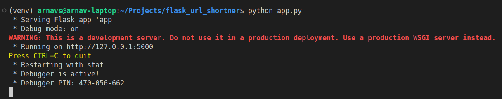
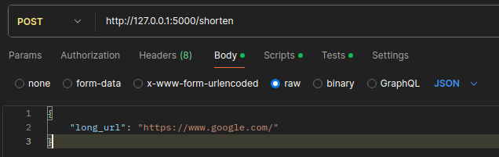
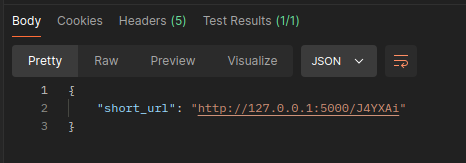
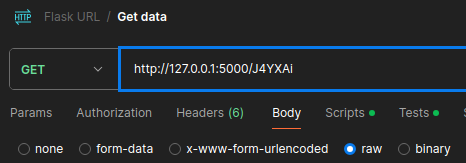
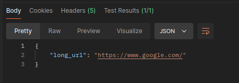
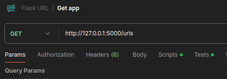
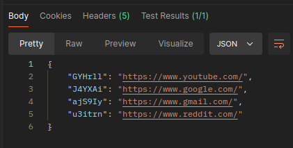

# Flask URL Shortener

A simple URL shortener built with Flask that allows users to shorten long URLs, retrieve the original URLs, and list all stored URLs. This application is entirely API-based and does not use a database, storing data in memory.

## Table of Contents

- [Features](#features)
- [Technologies Used](#technologies-used)
- [Installation](#installation)
- [Usage](#usage)
- [API Endpoints](#api-endpoints)
- [Running Tests](#running-tests)

## Features

- Shorten long URLs.
- Retrieve the original long URL from a short code.
- List all stored URLs.


## Technologies Used

- Python
- Flask


## Installation

Follow these steps to set up the project on your local machine:

1. **Clone the repository:**

    Using ssh:
   ```bash
   git clone git@github.com:srmaarnav/url_shortner.git
   cd flask_url_shortner
    ```

    Using HTTPS:
    ```
    git clone https://github.com/srmaarnav/url_shortner.git
    cd flask_url_shortner
    ```

2. **Setup the environment**

    To create the environment:
    ```
    python -m venv venv
    ```

    To activate the environment:

    For windows:
    ```
    venv\Scripts\activate
    ```

    For Linux/Mac:
    ```
    source venv/bin/activate
    ```

    To install all the requirements, we can directly install requirements.txt as:
    ```
    pip install -r requirements.txt
    ```

    After all this, the environment is set up.


## Usage

**Run the application**
Making sure the virtual environment is activated, run the application as:
```
python app.py
```
The application will start on `http://localhost:5000`

**Test the API**
You can use Postman or cURL to check the API effectiveness. Here, Postman is used to demonstrate.



For the **POST** request:






For the **Get** request (for specific short url):






For the **Get** request (list all):






## API Endpoints


    | Endpoint       | Method | Description                                    |
    |----------------|--------|------------------------------------------------|
    | /shorten       | POST   | Create a short URL from a long URL.            |
    | /<short_code>  | GET    | Retrieve the long URL corresponding to the short code. |
    | /urls          | GET    | List all stored URLs.                          |
    

## Running Tests

To run all the tests defined, ensure that the application is not running in the background, then run the following code:

```
    python -m unittest test_app 
```
